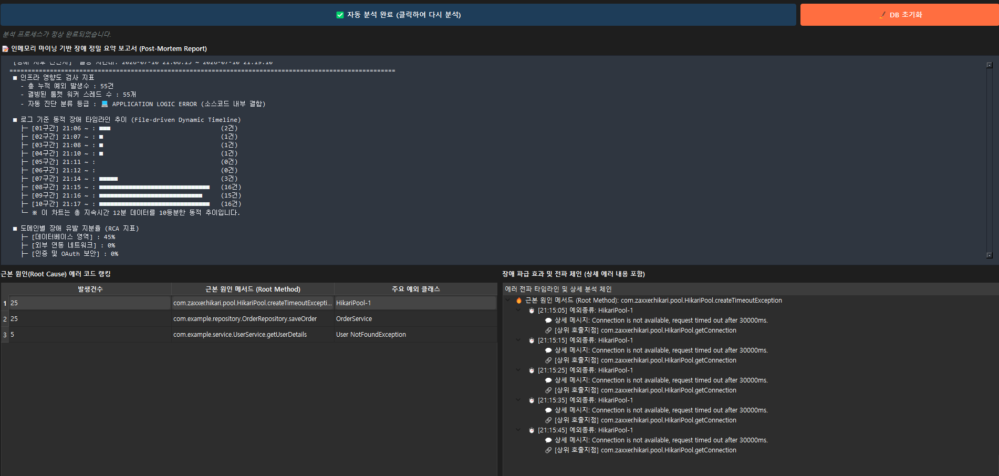

# 😾 Tomcat Graph-Based RCA Analyzer

> **Graph Database Engine (Kùzu) & PyQt6 Powered Dynamic Tomcat Log RCA POC**

`Tomcat Graph-Based RCA Analyzer`는 톰캣 대용량 로그 파일(`catalina.out`)을 파싱하여 장애 원인을 그래프 데이터 모델로 구축하고, 구조화된 인메모리 마이닝 기법을 통해 **근본 원인(Root Cause Analysis, RCA)** 및 장애 전파 체인을 추적하는 데스크톱 GUI 진단 도구입니다.

초고속 임베디드 그래프 DB인 **Kùzu**를 결합하여, 단순한 텍스트 매칭을 넘어 에러의 상위 호출 지점과 스레드 결빙 현상을 유기적으로 시각화 및 분석합니다.

---



## ✨ 핵심 기능 (Key Features)

- **Graph DB Architecture**: `Thread -> Exception -> Method -> Class`로 이어지는 복잡한 스택 트레이스 관계를 그래프 모델 스키마로 설계하여 `MATCH`/`MERGE` 쿼리로 정밀 추적합니다.
- **Auto-Diagnosis Engine**: 수집된 예외 데이터를 분석하여 4대 장애 등급(🔴 DB 병목, ⚡ 외부 망 유실, 🔑 인증 결함, 💻 로직 에러)을 분류하고 대응 가이드를 담은 **사후 진단서(Post-Mortem Report)**를 자동 작성합니다.
- **File-driven Dynamic Timeline**: 로그의 타임스탬프를 10개의 구간으로 실시간 수치화하여 장애 집중 발생 시간대를 텍스트 차트로 동적 렌더링합니다.
- **Trace Propagation Chain**: 특정 Root Cause 에러 메서드를 선택하면, 해당 장애의 상위 호출 지점(`CALLS`) 및 하위 전파 타임라인을 트리 구조(`QTreeView`)로 계층 분석합니다.
- **Responsive Background Parsing**: 대용량 로그 데이터 파싱 시 GUI 정지를 방지하기 위해 독립적인 `QThread` 워커 시스템을 탑재하고, 버튼 레이블을 통해 직관적인 진행 상태 피드백을 전달합니다.

---

## 🛠️ 사용 기술 (Tech Stack)

- **Language**: Python 3.x
- **Graph Database**: [Kùzu](https://kuzudb.com/) (Embedded Graph Database)
- **GUI Framework**: [PyQt6](https://www.riverbankcomputing.com/software/pyqt/)
- **Pattern Matching**: Regular Expressions (Regex)

---

## 📐 그래프 데이터베이스 모델 스키마

에러가 발생한 지점의 연쇄 관계를 규명하기 위해 아래와 같은 그래프 토폴로지 구조를 구축합니다.

- `(Thread) -[:RAISED]-> (Exception)` : 특정 스레드에서 예외 발생
- `(Exception) -[:OCCURRED_IN]-> (Method)` : 해당 예외가 특정 메서드 내에서 발현
- `(Method) -[:BELONGS_TO]-> (Class)` : 메서드가 속한 클래스 구조 정의
- `(Method) -[:CALLS]-> (Method)` : 스택 트레이스 기반 상위/하위 호출 흐름 연결

---

## 🔄 로그 기반 데이터 변환 및 저장 프로세스 (Parsing & Indexing Flow)

`catalina.out` 로그 파일의 텍스트 한 줄 한 줄이 파싱되어 그래프 DB 노드와 관계(Edge)로 변환되는 전체 프로세스입니다.

### 1. 처리 알고리즘 흐름

```text
[ 1. 스키마 & Primary Key 인덱스 정의 ]
                   ↓
[ 2. ERROR 헤더 로그 감지 (Regex 매칭) ]
                   ↓
[ 3. Thread & Exception 노드 / RAISED 관계 생성 ]
                   ↓
[ 4. 스택 트레이스 연속 블록 수집 (최대 Depth 5) ]
                   ↓
[ 5. Root Method 추출 / OCCURRED_IN 관계 연결 ]
                   ↓
[ 6. 스택 역순 분석으로 상위 호출자(CALLS) 연결 ]

```

### 2. 실제 로그 텍스트 ➔ 그래프 DB 변환 예시

#### 📄 파싱 대상 로그

```text
2026-07-23 14:30:15.123 [http-nio-8080-exec-5] ERROR com.example.controller.OrderController - java.sql.SQLException: Connection timeout
	at com.example.repository.OrderRepository.findOrder(OrderRepository.java:45)
	at com.example.service.OrderService.processOrder(OrderService.java:30)
	at com.example.controller.OrderController.create(OrderController.java:15)

```

#### ⚙️ 단계별 그래프 DB 매핑 동작

1. **ERROR 헤더 라인 분석**:

- `Thread` 노드 생성 (`name: 'http-nio-8080-exec-5'`)
- `Exception` 노드 생성 (`id: 'err_1'`, `type: 'java.sql.SQLException'`, `message: 'Connection timeout'`)
- `(Thread) -[:RAISED]-> (Exception)` 관계 연결

2. **첫 번째 스택 트레이스 라인 (에러 직접 발생 지점 / Root Cause)**:

- `at com.example.repository.OrderRepository.findOrder(...)`
- `Class` (`OrderRepository`) 및 `Method` (`OrderRepository.findOrder`) 노드 생성
- 근본 원인이므로 `(Exception) -[:OCCURRED_IN]-> (Method:findOrder)` 직접 연결

3. **연속된 스택 트레이스 라인 분석 (상위 호출 체인 추적)**:

- 다음 `ERROR` 또는 일반 로그가 나오기 전까지 연속된 `at ...` 줄을 하나의 호출 묶음(Call Chain)으로 인식합니다.
- 자바 스택 특성상 **아래 줄이 위 줄을 호출한 상위 호출자**입니다.
- `(OrderService.processOrder) -[:CALLS]-> (OrderRepository.findOrder)`
- `(OrderController.create) -[:CALLS]-> (OrderService.processOrder)`

#### 🌐 최종 완성된 그래프 데이터 토폴로지

```text
(Thread: http-nio-8080-exec-5)
       │
   [RAISED]
       ↓
(Exception: err_1 / SQLException) ──[OCCURRED_IN]──> (Method: OrderRepository.findOrder) ──[BELONGS_TO]──> (Class: OrderRepository)
                                                                    ▲
                                                                [CALLS]
                                                                    │
                                                     (Method: OrderService.processOrder) ──[BELONGS_TO]──> (Class: OrderService)
                                                                    ▲
                                                                [CALLS]
                                                                    │
                                                     (Method: OrderController.create)    ──[BELONGS_TO]──> (Class: OrderController)

```

- **포인트 (In-Memory Index & MERGE)**: `MERGE` 구문과 PK 인덱스(`Thread.name`, `Exception.id`, `Method.fullName`) 덕분에 중복 노드가 자동 제거되며, 수만 건의 에러 로그가 들어와도 동일한 메서드 노드에 가지처럼 에러들이 연결되어 파급 효과를 직관적으로 분석할 수 있습니다.

---

## 🚀 시작하기 (Getting Started)

### 1. 필수 패키지 설치

프로젝트 실행을 위해 아래 라이브러리들을 설치해야 합니다.

```bash
pip install PyQt6 kuzu

```

### 2. 프로젝트 실행

구동 환경이 준비되면 메인 스크립트를 실행합니다.

```bash
python tomcat_rca_analyzer.py

```

---

## 💡 주요 코드 하이라이트 (Cypher 쿼리를 통한 인프라 마이닝)

Kùzu 그래프 엔진의 Cypher 쿼리를 통해 예외 클래스와 메시지 특징을 결합, 단순 통계가 아닌 인프라 영향 지표 및 RCA 연산 알고리즘을 수행하는 핵심 로직 예시입니다.

```python
# 가장 빈번하게 장애를 유발한 근본 원인(Root Cause) 메서드 및 상위 예외 추출
root_query = """
    MATCH (ex:Exception)-[:OCCURRED_IN]->(m:Method)
    RETURN Count(ex) as cnt, m.fullName, ex.type
    ORDER BY cnt DESC
    LIMIT 10
"""
res_root = self.conn.execute(root_query)

```

---

## 📄 라이선스 (License)

이 프로젝트는 MIT 라이선스 하에 자유롭게 수정 및 배포가 가능합니다.

```

```
